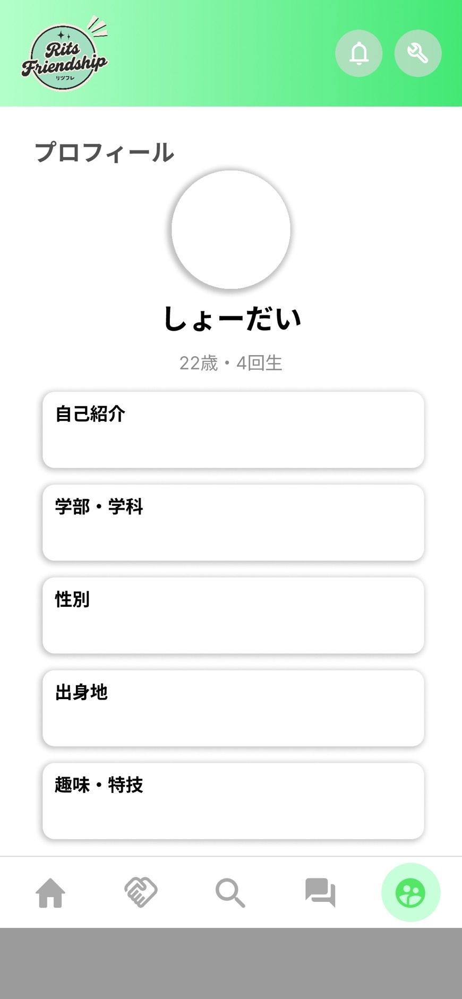

# プロフィール
　立命館大学で電子情報工学を学びながら、サークルでアプリ開発に取り組んでいます。
主に React Native と TypeScript を用いたモバイルアプリ開発を行っており、開発だけでなく、サークル内ではデザインリーダーやプロジェクトマネージャー（PM）としての役割も担当しています。
## 🌱経歴

| 時期 | 内容 |
|------|------|
| 2020年4月〜 | 地元の高校に入学 |
| 2021年4月〜 | 水泳部 部長に就任 |
| 2023年4月〜 | 立命館大学 電子情報工学科に入学 |
| 2024年4月〜 | アプリ開発サークル 参加 |
| 2024年4月〜 | 学生生活支援アプリ「歩くアルパカ+R」の一部フロントエンド実装を担当 |
| 2025年3月～ | アプリ開発サークル　幹部に就任|
| 2025年4月～ | 個人開発アプリ「家事タイム」の作成|
| 2025年5月～ | 基本情報技術者試験　合格|
| 2025年8月～ | 個人開発アプリ「ワリタビ」の作成|
| 2025年8月～ | 大阪・関西万博のアプリ開発|
| 2025年9月～ | 中学生向けにプログラミング授業を実施|
| 2025年9月～ | 株式会社STAR UP 長期インターンシップ参加|

## 💻スキル

- **プログラミング言語**：JavaScript / TypeScript / Python / C言語 / SQL / MATLAB / Emacs
- **フレームワーク・ライブラリ**：React Native / React / Expo / next
- **ツール・環境**：Git / GitHub / Figma / Firebase / VSCode 

## 🚀実績

|アプリ名|内容|参照先|
|----------|----------|----------|
|家事タイム|家事の予定を簡単に管理するモバイルアプリ|[GitHubリンクはこちら](https://github.com/Hideto6/housework-time) |
|ワリタビ|シンプルで使いやすく、レスポンシブデザインに対応した旅行割り勘アプリ|[GitHubリンクはこちら](https://github.com/Hideto6/separate_check_w) [アプリのURLはこちら](https://waritabi.vercel.app)|
|歩くアルパカ+R|立命館大学生向けの学生生活サポートアプリ(※figmaによるデザイン作成、一部機能のフロントエンド実装を担当）|[アプリのURLはこちら](https://apps.apple.com/jp/app/%E5%A4%A7%E5%AD%A6%E7%94%9F%E6%B4%BB%E6%94%AF%E6%8F%B4%E3%82%A2%E3%83%97%E3%83%AAfor%E7%AB%8B%E5%91%BD%E9%A4%A8-%E6%AD%A9%E3%81%8F%E3%82%A2%E3%83%AB%E3%83%91%E3%82%AB-r/id6499567971)|
|リツフレ|立命館大学生向け学内交流アプリ(※figmaによるデザイン作成、一部機能のフロントエンド実装を担当)|下記にデザインのスクリーンショットを掲載|
|ジェスチャーゲーム|サークルの新入生歓迎会用に作成したジェスチャーゲームアプリ(※figmaによるデザイン作成、一部機能のフロントエンド実装を担当)|下記にデザインのスクリーンショットを掲載|

### 📱リツフレ - スクリーンショット

  
  

  
  

  

### 📱ジェスチャーゲーム - スクリーンショット

  
  

  
  

